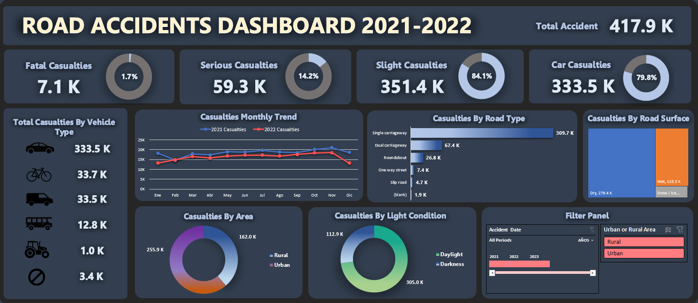

# Road Accidents Dashboard 2021-2022

Welcome to the Road Accidents Data Analysis Project! This project focuses on analyzing road accidents data from 2021 to 2022 using Microsoft Excel.

## Project Objective

The objective of this project is to analyze road accident trends from 2021 to 2022. By doing so, patterns and factors contributing to accidents will be identified, aiding in the development of strategies to enhance road safety in the future.

## Project Overview

### Data

You can see the dataset here [Road Accidents Dataset](./dataset.csv)

### Project

You can see the final project here [Project](./dashboard.xlsx)

### Conclusions

- Daylight is the light condition with the highest casualties (305K)
- Urban is the area with the highest casualties (256K)
- November is the month with the highest casualties (39K)
- Car is the vehicle type with the highest casualties (334K)
- Slight is the accident severity with the highest casualties (351K)
- Single carriageway is the road type with the highest casualties (310K)
- Dry is the road surface with the highest casualties (279K)
